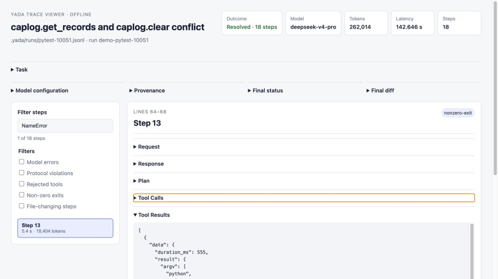

# Yada

**Yet Another DeepSeek Agent** is a small, auditable coding-agent harness built
for DeepSeek V4. Give it a task and a Git repository; Yada inspects the code,
applies a checked patch, runs verification, and records a trace of the run.

[中文说明](README-cn.md)

> Just want to use Yada? Follow **Quick start** below. Want to contribute?
> Start with [CONTRIBUTING.md](CONTRIBUTING.md) and the
> [developer docs](docs/dev/architecture.md).

Yada is currently alpha software. The local agent loop is tested, but the
project does not claim a comparative benchmark result yet.

## Requirements

- Python 3.11+
- Git
- [uv](https://docs.astral.sh/uv/) (recommended)
- A DeepSeek API key

Docker is optional for direct runs and `yada eval --case`. Official
`yada eval --swebench` runs require a running, maintained Docker Desktop or
Docker Engine release; see [Docker requirements](docs/configuration.md#docker-requirements)
for installation, verification, version policy, and resource guidance.

## Quick start

```bash
git clone https://github.com/GenTang/Yada.git
cd Yada
uv sync --locked --dev

install -d -m 700 ~/.config/yada
(umask 077; touch ~/.config/yada/deepseek_api_key)
chmod 600 ~/.config/yada/deepseek_api_key
${EDITOR:-vi} ~/.config/yada/deepseek_api_key

uv run yada "Fix the failing parser edge case and run the relevant tests" \
  --workspace /path/to/repository
```

Enter only the API key in that file. Yada also accepts
`--api-key-file /run/secrets/deepseek_api_key` for mounted secret stores; see
[Configuration](docs/configuration.md#deepseek-credentials).

Yada asks before running repository commands. Use `--yes` only inside a trusted,
disposable environment:

```bash
uv run yada --task-file issue.md --workspace /workspace --yes
```

## What happens next

Yada prints each DeepSeek turn and tool execution, then reports whether the task
passed its verification gate. Traces are written under the target repository's
`.yada/runs/` directory by default.

Unfamiliar projects may contain and execute arbitrary code. Yada provides
guardrails, but it is not a complete operating-system sandbox, so running such
projects can still put your system at risk. Use a disposable VM or container
when working with unfamiliar projects.

## Inspect every step

Turn any JSONL trace into a self-contained offline viewer—no server, CDN, or
additional runtime dependency required:

```bash
uv run yada-trace TRACE.jsonl --html
```

[](docs/assets/yada-trace-viewer.jpg)

## Learn more

- [Configuration](docs/configuration.md): installation alternatives, API key,
  model settings, command policy, and trace levels.
- [CLI reference](docs/cli-reference.md): `yada`, `yada eval`, and `yada-trace`.
- [Evaluation lifecycle](docs/evaluation.md): what `--case` and `--swebench`
  load, mutate, cache, grade, and write.
- [Contributing](CONTRIBUTING.md): development setup, validation, and the rebase
  pull-request workflow.
- [Architecture](docs/dev/architecture.md): agent loop, tools, patch transaction,
  evaluation boundaries, and safety invariants.
- [Debugging](docs/dev/debugging.md): tests, trace inspection, and reproducible
  issue reports.

Yada is licensed under the [MIT License](LICENSE).
