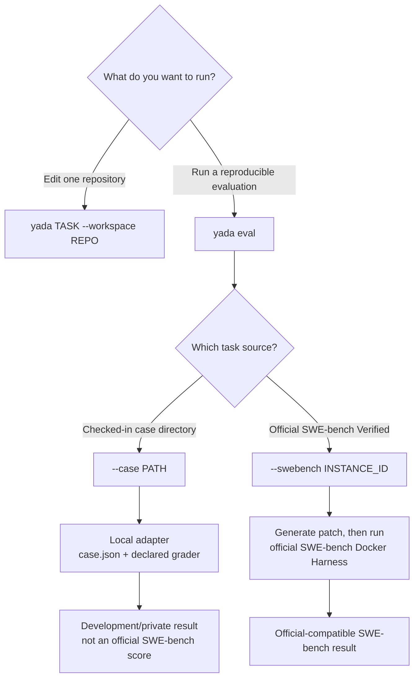

# CLI reference

Yada installs two entry points:

- `yada`: run the coding agent or an evaluation;
- `yada-trace`: inspect a JSONL execution trace.

Examples below use `uv run`. After editable pip installation, omit `uv run`.
Run `uv run yada --help`, `uv run yada eval --help`, or
`uv run yada-trace --help` for the parser-generated reference.

## `yada`

```text
yada TASK [OPTIONS]
yada --task-file FILE [OPTIONS]
```

Provide exactly one task source. The workspace defaults to the current directory.

```bash
uv run yada "Fix the parser boundary case and run its tests" \
  --workspace /path/to/repository

uv run yada --task-file issue.md --workspace /path/to/repository
```

### Options

| Option | Meaning | Default |
| --- | --- | --- |
| `TASK` | Natural-language coding task. | — |
| `--task-file PATH` | Read the task from a UTF-8 file. | — |
| `--workspace PATH` | Target Git workspace. | Current directory |
| `--model NAME` | DeepSeek model name. | `DEEPSEEK_MODEL` or `deepseek-v4-pro` |
| `--base-url URL` | DeepSeek-compatible API base URL. | `DEEPSEEK_BASE_URL` or `https://api.deepseek.com` |
| `--reasoning-effort high\|max` | Thinking effort. | `max` |
| `--thinking` / `--no-thinking` | Enable or disable thinking. | Enabled |
| `--max-steps N` | Maximum model turns. | `30` |
| `--max-output-tokens N` | Maximum tokens requested per completion. | `16384` |
| `--api-timeout SECONDS` | Timeout for one model request. | `300` |
| `--command-timeout SECONDS` | Default repository-command timeout. | `120` |
| `--command-policy ask\|allow\|deny` | Repository-command approval policy. | `ask` |
| `--yes` | Alias for command policy `allow`. | Off |
| `--trace PATH` | Exact JSONL trace path. | `.yada/runs/<task>__<time>.jsonl` |
| `--trace-level summary\|debug` | Trace capture detail. | `summary` |
| `--version` | Print the Yada version. | — |

Exit status is `0` after verified completion, `2` when the step limit or another
unfinished outcome is reached, `3` for a DeepSeek API error, and `130` after
keyboard interruption. Argument errors also use the standard argparse status `2`.

## `yada eval`

`yada eval` runs an agent behind a benchmark-neutral adapter and persists a
schema-versioned result even for ordinary adapter failures. Unlike a direct
`yada` run, an evaluation always has a task adapter and a grader.

### Choose a run mode



`yada eval` deliberately exposes only two task selectors:

| Invocation | Meaning | Grader |
| --- | --- | --- |
| `--case PATH` | Run a portable local case. A directory resolves to `PATH/case.json`; a manifest file may also be passed directly. | The command declared by the case manifest |
| `--swebench INSTANCE_ID` | Load one SWE-bench Verified task, generate a prediction, and delegate grading to the official Docker Harness. | Official SWE-bench Docker Harness |

There is no `--local`, `--benchmark`, or separate `--manifest` selector. Pass a
custom manifest directly to `--case`. A case is called local because its
manifest controls preparation and grading; it may still fetch a Git repository
and call the DeepSeek API. Each invocation runs exactly one task.

### Checked-in development case (`--case`)

Use a checked-in case for fast development and regression testing:

```bash
uv run yada eval \
  --case benchmarks/swebench_verified/pytest-10051 \
  --agent yada \
  --yes \
  --trace-level debug
```

The first run fetches the pinned pytest commit and builds the case's locked
Python environment. Later runs reuse caches but create a fresh agent workspace.
The case's grader is a development feedback loop, not the official SWE-bench
Docker grader, even though the task originated in SWE-bench Verified.

For a private or machine-local task, pass its manifest through the same entry
point:

```bash
uv run yada eval \
  --case /path/to/task.local.json \
  --agent yada \
  --yes
```

A minimal version 1 case manifest is:

```json
{
  "schema_version": 1,
  "instance_id": "example__repo-1",
  "task_file": "task.md",
  "workspace": "candidate",
  "workspace_mode": "copy",
  "base_commit": "0123456789abcdef",
  "grader": {
    "argv": ["python", "grader.py", "{workspace}"],
    "timeout_seconds": 1800
  }
}
```

Paths are relative to the manifest. `workspace_mode=copy` preserves the source
fixture and gives each run a fresh copy. An in-place workspace is also supported
for explicitly local experiments. The grader runs after the agent exits:

- exit `0`: resolved;
- exit `1`: unresolved;
- any other exit: grading error.

Grader argv entries may use `{workspace}`, `{patch}`, `{run_dir}`, and `{run_id}`.

A portable case can replace `workspace` with a pinned Git source and define a
locked uv environment:

```json
{
  "schema_version": 1,
  "instance_id": "owner__repo-1",
  "instance_file": "instance.json",
  "workspace": {
    "type": "git",
    "url": "https://github.com/owner/repo.git",
    "cache_key": "verified/owner__repo-1"
  },
  "base_commit": "0123456789abcdef",
  "environment": {
    "type": "uv",
    "project": ".",
    "install_workspace": "editable",
    "pythonpath": ["src"]
  },
  "grader": {
    "argv": [".venv/bin/python", "grader.py", "{workspace}"]
  }
}
```

Portable Git checkouts are cached under `--cache-dir` (default
`.yada/cache/evals`) but never used directly as the mutable agent workspace.
`install_workspace` accepts `editable` and `legacy-editable`.

### Official SWE-bench evaluation (`--swebench`)

The official SWE-bench Harness is the single source for both public instance
metadata and Docker grading. `--swebench` does not read the checked-in local
case's `instance.json`, so there are no local and online copies to keep in sync.
Gold patches, test patches, and hidden test IDs do not cross the public task
boundary. Yada fetches the exact base commit, prepares a clean candidate
workspace, and generates the patch that the Harness grades.

Install and start Docker. The official `swebench` package is published on PyPI,
so no SWE-bench Git clone or separately managed virtual environment is needed.
Use uv's cached dependency overlay to run the pinned Harness version:

```bash
uv run --with 'swebench==4.1.0' yada eval \
  --swebench pytest-dev__pytest-10051 \
  --agent yada \
  --yes \
  --trace-level debug
```

The first run downloads the Harness and its dependencies into uv's cache;
subsequent runs reuse them. This keeps Yada's core dependency-free and leaves
the project environment unchanged. If `swebench==4.1.0` is already installed in
Yada's active environment, the shorter `uv run yada eval ...` form also works.

The adapter intentionally fixes the current public evaluation policy instead of
exposing Harness internals as Yada CLI flags:

| Setting | Built-in policy |
| --- | --- |
| Dataset | `princeton-nlp/SWE-bench_Verified` |
| Split | `test` |
| Grading | Official Docker Harness |
| Image cache | Keep environment images |
| Grading timeout | 1800 seconds |
| Docker namespace | `swebench`; automatically disabled on Apple Silicon so images build locally |

Apple Silicon support in SWE-bench remains experimental. Building images locally
takes substantially more time and disk space than running a checked-in case.

### External command agent (`--agent command`)

The command adapter runs a non-interactive argv without a shell:

```bash
uv run yada eval \
  --case /path/to/task.local.json \
  --agent command \
  --agent-name another-agent \
  --agent-command \
    'another-agent run --task-file {task_file} --workspace {workspace}' \
  --output results/another-agent.json
```

The template supports `{task}`, `{task_file}`, `{workspace}`, `{output_patch}`,
and `{run_dir}`. If the command does not write `{output_patch}`, Yada collects
the complete Git diff, including untracked files.

### Common evaluation options

| Option | Meaning | Default |
| --- | --- | --- |
| `--case PATH` | Portable local case directory or `case.json`. | Mutually exclusive with `--swebench` |
| `--swebench ID` | One official SWE-bench Verified instance. | Mutually exclusive with `--case` |
| `--agent yada\|command` | Agent adapter. | `yada` |
| `--output PATH` | Result JSON path. | `eval-results/<task>__<time>.json` |
| `--artifact-dir PATH` | Workspace, logs, patch, trace, and grader artifacts. | Sibling `<result>.artifacts` |
| `--run-id ID` | Stable correlation ID. | Generated |
| `--max-steps N` | Model-turn budget. | `30` |
| `--wall-time SECONDS` | Comparable wall-time budget. | `1800` |
| `--max-output-tokens N` | Per-completion token limit. | `16384` |

The native agent also accepts the model, thinking, timeout, command-policy, and
trace-level options documented for `yada`. A deployment-level supervisor should
enforce a hard wall-time limit for an in-process native agent. Use the same task,
base commit, model budget, network policy, and grader when comparing agents.

Evaluation exits with `0` for `resolved`, `1` for `unresolved`, and `2` for
errors or non-verdict outcomes such as skipped grading.

## `yada-trace`

```text
yada-trace TRACE.jsonl [--step N | --verbose | --events]
```

| Option | Meaning |
| --- | --- |
| `--step N` | Expand one complete request → response → tools step. |
| `--verbose` | Expand payloads inside every grouped step. |
| `--events` | Show the flat event timeline with physical JSONL line numbers. |

The default view groups records by agent step and shows physical JSONL line
references for the model request/response and each tool call/result pair:

```bash
uv run yada-trace TRACE.jsonl
uv run yada-trace TRACE.jsonl --step 8
uv run yada-trace TRACE.jsonl --events
```

`yada-trace` returns `0` after rendering and `2` for an unreadable or invalid
trace. See the [debugging guide](dev/debugging.md) for event semantics, trace
levels, `jq` recipes, and reproduction workflows.

## Output naming

Default direct-run and evaluation names contain a sanitized task name and the
system-local time at minute precision. If a name exists, Yada appends `(1)`,
`(2)`, and so on. An evaluation result JSON and its `.artifacts` directory always
share the same collision number. Explicit `--trace`, `--output`, and
`--artifact-dir` paths are never renamed.
