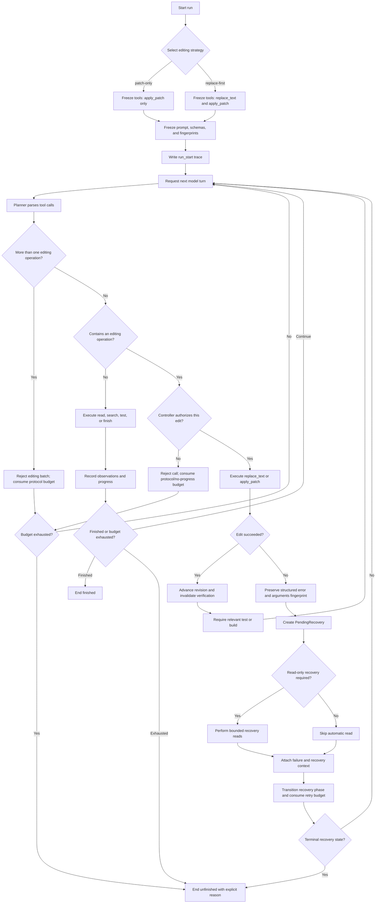
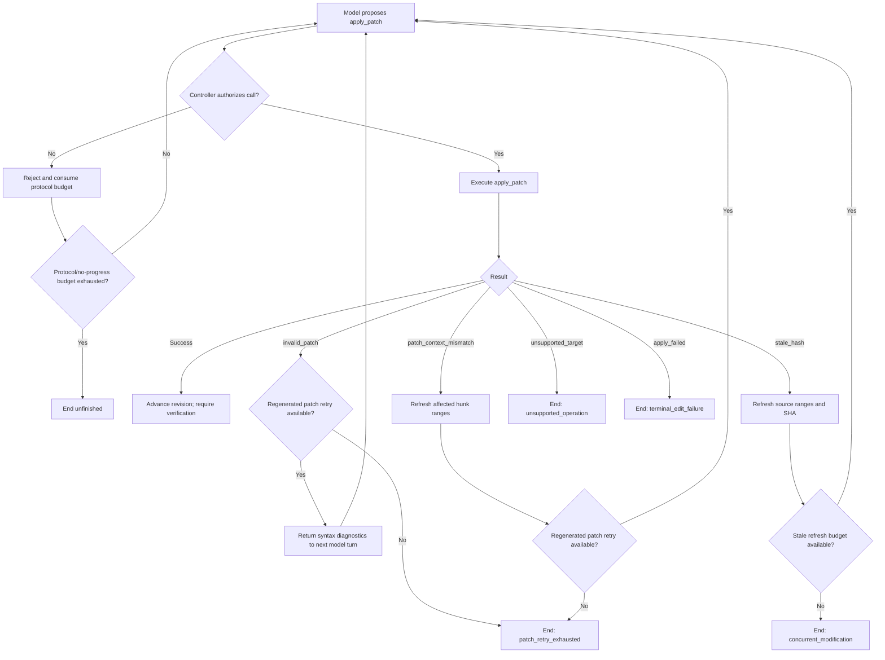
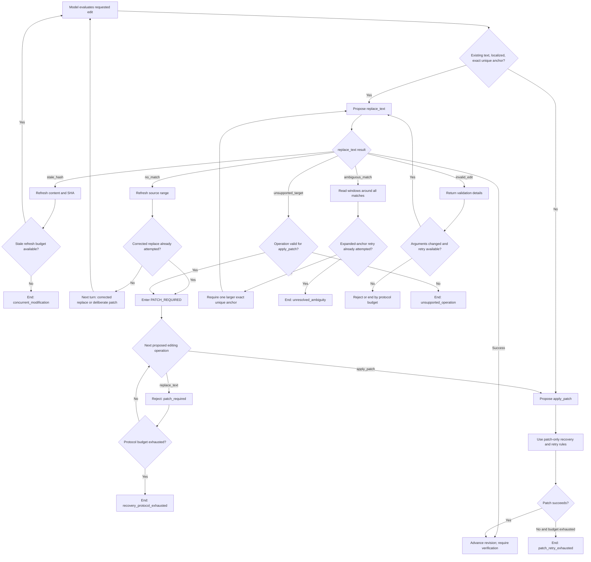

# Editing Strategy and Recovery Algorithm

## Status

This document specifies the implementation algorithm for
[Issue #10: replace-first routing with apply_patch fallback](https://github.com/GenTang/Yada/issues/10).
It consolidates the routing, recovery, safety, bounded-retry, tracing, testing,
and evaluation rules needed to implement the issue.

The key architectural decision is:

> The model decides how to express an edit. Yada deterministically controls
> which editing operations are currently allowed, supplies safe recovery
> context, bounds retries, and terminates explicitly when progress cannot be
> made.

This is a hybrid design:

- the Agent retains flexibility for semantic decisions;
- Yada enforces safety and control-flow invariants in ordinary code;
- a rejected `replace_text` call is never silently converted into an
  `apply_patch` call;
- every run finishes or fails in a finite number of steps.

## 1. Scope

### 1.1 Goals

The implementation must:

1. Support the run-level strategies `patch-only` and `replace-first`.
2. Keep the selected strategy, prompt, and tool schemas stable for the complete
   run.
3. Prefer `replace_text` for localized changes to existing text when an exact,
   unique anchor is available.
4. Use `apply_patch` for file creation, deletion, unsuitable structural edits,
   and other operations that `replace_text` does not support.
5. Return a failed edit to the Agent before another edit is attempted.
6. Prevent stale or ambiguous replacement failures from causing blind fallback.
7. Preserve SHA binding, transactionality, touched-file accounting, revision
   tracking, and post-edit verification.
8. Prevent infinite retry loops in both strategies.
9. Make routing and recovery paths reconstructable from traces.
10. Support deterministic tests with mocked model/tool interactions.
11. Add no runtime dependency.

### 1.2 Non-goals

This design does not add:

- same-call automatic fallback;
- fuzzy or whitespace-normalized matching;
- automatic selection between ambiguous locations;
- AST-based edit routing;
- an external fast-apply model;
- a new public orchestration tool;
- a guarantee that the model can always generate a correct patch;
- removal of the `patch-only` compatibility baseline.

## 2. Terminology

### Agent turn

One model response and the tool calls proposed by that response.

### Editing operation

A tool call that changes workspace files. In this issue, the editing operations
are:

- `replace_text`;
- `apply_patch`.

Earlier discussions sometimes call these operations *mutations*. This document
uses *editing operation* unless referring to the metric name from Issue #10.

### Read-only recovery

A bounded `read_file` operation performed to refresh the source content and
SHA after an edit failure. Read-only recovery does not change workspace files
and is not a fallback edit.

### Fallback

A later Agent turn deliberately choosing `apply_patch` after observing a
failed `replace_text` result and any required recovery context.

### Recovery episode

The interval beginning with one failed editing operation and ending when:

- a later edit succeeds;
- the controller reaches a terminal failure;
- the run exhausts a recovery or protocol budget.

### Progress

An event that materially advances the run. The exact definition is given in
[Section 10](#10-bounded-retries-and-loop-prevention).

## 3. Required invariants

The implementation must preserve the following invariants.

1. **Stable strategy:** `editing_strategy` cannot change after run start.
2. **Stable interface:** the prompt and tool schemas cannot change during the
   run.
3. **Single edit per turn:** at most one editing operation may execute from one
   Agent turn.
4. **Observed failure:** a failed edit must be present in the next model request
   before a later edit may execute.
5. **Fresh context:** errors that require re-reading must have a post-failure
   read snapshot visible to the model before the next accepted edit.
6. **No hidden edit:** automatic recovery may read files but may never generate
   or execute `replace_text` or `apply_patch`.
7. **No blind fallback:** `stale_hash` and `ambiguous_match` may not directly
   trigger an automatic patch.
8. **No side effects on failure:** a failed edit must not advance the workspace
   revision, touched-file set, patch count, or verified revision.
9. **Verification invalidation:** a successful edit invalidates previous
   verification.
10. **Transactional fallback:** a successful fallback uses the same SHA,
    validation, transaction, and verification boundary as any other patch.
11. **Finite execution:** every retry path consumes a finite budget or reaches a
    terminal state.
12. **Trace completeness:** the strategy, tool choice, result, error code,
    recovery reads, state transitions, rejections, retries, and terminal reason
    must be traceable.

## 4. Responsibilities

### 4.1 Model responsibilities

The model is responsible for:

- understanding the requested code change;
- deciding whether a localized exact replacement is suitable;
- constructing `old_text` and `new_text`;
- constructing a unified diff when using `apply_patch`;
- revising its plan after observing structured errors and refreshed content;
- running relevant verification before `finish`.

### 4.2 Yada responsibilities

Yada is responsible for:

- selecting and freezing the run strategy;
- exposing the appropriate stable tool interface;
- enforcing one editing operation per Agent turn;
- authorizing or rejecting proposed editing operations according to recovery
  state;
- performing deterministic read-only recovery when possible;
- rejecting unchanged retries;
- bounding patch, replace, protocol, and no-progress loops;
- preserving SHA and transactional guarantees;
- ending the run explicitly when recovery is exhausted;
- recording the complete control path in traces.

### 4.3 Guarantee boundary

Yada can guarantee:

- that a disallowed edit does not execute;
- that a required re-read occurs before a later accepted edit;
- that `PATCH_REQUIRED` accepts no further `replace_text` edit;
- that retries are finite;
- that failure is explicit and auditable.

Yada cannot guarantee:

- that the model will call `apply_patch` when requested;
- that generated patch arguments are syntactically valid;
- that a valid patch solves the user task;
- that every run completes successfully.

When the model cannot produce an allowed, valid edit within the budgets, the run
must end as `unfinished`; Yada must not manufacture a permissive edit behind the
Agent's back.

## 5. State model

The editing controller should be implemented as a small state machine whose
transition logic can be tested as a pure function.

```python
from dataclasses import dataclass, field
from enum import Enum


class EditingStrategy(str, Enum):
    PATCH_ONLY = "patch-only"
    REPLACE_FIRST = "replace-first"


class RecoveryPhase(str, Enum):
    NORMAL = "normal"
    NEED_READ = "need-read"
    NEED_MODEL_READ = "need-model-read"
    READY_TO_REPLAN = "ready-to-replan"
    REPLACE_RETRY_ALLOWED = "replace-retry-allowed"
    PATCH_RETRY_ALLOWED = "patch-retry-allowed"
    PATCH_REQUIRED = "patch-required"
    TERMINAL_FAILURE = "terminal-failure"


@dataclass(frozen=True)
class ReadSnapshot:
    path: str
    sha256: str
    start_line: int
    end_line: int
    available_to_model_at_step: int


@dataclass
class PendingRecovery:
    failed_step: int
    failed_tool_call_id: str
    failed_tool: str
    error_code: str
    paths: tuple[str, ...]
    arguments_fingerprint: str
    phase: RecoveryPhase
    corrected_retry_count: int = 0


@dataclass
class EditingRunState:
    strategy: EditingStrategy
    frozen_tool_names: tuple[str, ...]
    tool_schema_fingerprint: str
    prompt_fingerprint: str
    pending_recovery: PendingRecovery | None = None
    last_reads: dict[str, ReadSnapshot] = field(default_factory=dict)
    failure_counts: dict[tuple[int, str, str], int] = field(default_factory=dict)
    protocol_violation_count: int = 0
    no_progress_turns: int = 0
    edit_failures_this_revision: int = 0
    workspace_revision: int = 0
```

The recommended interface is:

```python
transition(state, event) -> tuple[new_state, actions]
```

Representative events include:

- `RunStarted`;
- `ModelTurnStarted`;
- `ToolCallProposed`;
- `ReadCompleted`;
- `EditSucceeded`;
- `EditFailed`;
- `ToolCallRejected`;
- `VerificationSucceeded`;
- `BudgetExhausted`.

Representative actions include:

- `ExecuteTool`;
- `PerformRecoveryRead`;
- `RejectToolCall`;
- `AppendObservation`;
- `WriteTraceEvent`;
- `EndRun`.

## 6. Run initialization

### 6.1 Strategy selection

The CLI and evaluation adapter must accept:

```text
--editing-strategy patch-only
--editing-strategy replace-first
```

`patch-only` remains the default until benchmark evidence justifies changing
it.

### 6.2 Stable tool exposure

For `patch-only`, expose:

```text
search_code
read_file
apply_patch
run_command
finish
```

For `replace-first`, expose:

```text
search_code
read_file
replace_text
apply_patch
run_command
finish
```

The tool collection must be created once during initialization. Recovery state
must not dynamically remove, reorder, or redefine tools. For example,
`PATCH_REQUIRED` leaves the schemas unchanged but deterministically rejects a
later `replace_text` call.

### 6.3 Stable prompt

The strategy-specific system prompt is also created once.

`patch-only` instructions state that all workspace edits use `apply_patch`.

`replace-first` instructions state:

- use `replace_text` for an existing regular text file when the change is local
  and `old_text` is exact and unique;
- use `apply_patch` directly for creation, deletion, rename, large structural
  rewrite, impractically large anchors, or unsupported targets;
- follow the structured recovery matrix;
- never treat a failed replacement as permission for same-turn fallback.

### 6.4 Run-start trace

The `run_start` event must contain at least:

```json
{
  "editing_strategy": "replace-first",
  "tool_names": [
    "search_code",
    "read_file",
    "replace_text",
    "apply_patch",
    "run_command",
    "finish"
  ],
  "tool_schema_fingerprint": "...",
  "prompt_fingerprint": "..."
}
```

The fingerprints make strategy comparisons auditable and detect accidental
mid-run drift.

## 7. Routing algorithm

### 7.1 `patch-only`

`replace_text` is not exposed. If an edit occurs, the model must express it as
`apply_patch`.

This guarantees which public editing tool is available, but it does not
guarantee that the model can generate a valid patch. Patch recovery and bounded
failure are therefore required; see [Section 11](#11-patch-only-control-flow).

### 7.2 `replace-first`

The model applies the following decision rule:

```python
def preferred_editing_tool(intent):
    if intent.creates_file:
        return "apply_patch"
    if intent.deletes_or_renames_file:
        return "apply_patch"
    if intent.is_large_structural_rewrite:
        return "apply_patch"
    if intent.requires_impractically_large_anchor:
        return "apply_patch"
    if intent.target_is_unsupported_by_replace:
        return "apply_patch"

    if (
        intent.targets_existing_regular_text
        and intent.is_localized
        and intent.has_exact_unique_anchor
    ):
        return "replace_text"

    return "apply_patch"
```

The semantic predicates such as `is_localized` are model judgments guided by
the prompt. The tools remain the deterministic backstop:

- `replace_text` validates file type, UTF-8, SHA, exact match count, limits, and
  transactionality;
- `apply_patch` validates declared targets, SHA, paths, patch syntax, context,
  and transactionality.

The framework must not add a second model or AST router merely to classify the
edit; those approaches are outside Issue #10.

## 8. Agent-turn execution algorithm

### 8.1 Batch validation

Define:

```python
EDITING_TOOLS = {"replace_text", "apply_patch"}
```

Before executing a model response:

```python
editing_calls = [
    call for call in tool_calls
    if call.name in EDITING_TOOLS
]

if len(editing_calls) > 1:
    reject_editing_batch(
        error_code="multiple_edit_operations",
        error="Only one editing operation is allowed per Agent turn.",
    )
```

The rejected editing calls produce no side effects. This prevents the sequence
below from executing in one turn:

```text
replace_text -> failure -> apply_patch
```

because the model could not have observed the replacement failure before it
generated the patch call.

### 8.2 Recovery authorization

Before an editing call executes, the controller checks:

1. Is this editing tool allowed by the current recovery phase?
2. Has every required post-failure read become visible to the model?
3. Are the arguments different from an already rejected attempt?
4. Is the relevant retry budget still available?
5. Is the run already in a terminal state?

If any condition fails, the call is rejected with a structured observation and
no edit is executed.

### 8.3 Read visibility

A model-generated read and edit in the same turn cannot satisfy a recovery
precondition: the model generated the edit before seeing the read result.

For that reason, a read snapshot records:

```text
available_to_model_at_step
```

An edit in step `N` may use a recovery snapshot only if:

```python
snapshot.available_to_model_at_step <= N
```

An automatic recovery read performed between steps `N - 1` and `N` is visible
in step `N`. A `read_file` proposed by the model in step `N` becomes visible no
earlier than step `N + 1`.

## 9. Edit results and recovery

### 9.1 Success

On success:

```python
state.workspace_revision += 1
state.pending_recovery = None
state.edit_failures_this_revision = 0
state.no_progress_turns = 0
context.state.verified_revision = -1
context.state.touched_files.update(changed_paths)
```

The result includes the new revision, changed paths, and post-edit hashes. A
relevant test or build must succeed at the new revision before `finish`.

### 9.2 General failure procedure

For an editing failure:

1. Preserve the original structured error and bounded details.
2. Do not advance workspace or verification state.
3. Increment the per-revision edit failure counter.
4. Create a `PendingRecovery` object.
5. Determine whether read-only recovery is required.
6. Perform bounded automatic reads when a reliable range is available.
7. Attach the recovery context to the observation for the next model turn.
8. Transition to the error-specific recovery phase.
9. Never execute another edit from the same Agent turn.

Conceptually:

```text
edit failure
  -> structured result
  -> PendingRecovery
  -> optional automatic read-only recovery
  -> failure + recovery context in next model request
  -> later model decision
```

### 9.3 Automatic read-only recovery

Automatic reads strengthen the prompt-only recovery policy without violating
Issue #10: they do not edit the workspace, and fallback still happens only in a
later Agent turn after the model observes the failure.

The controller should retain the range of every successful `read_file` call.

Recommended recovery ranges:

- `stale_hash`: re-read the last ranges used for each affected path and obtain
  the current SHA;
- `no_match`: re-read the last ranges from which the proposed anchor was
  derived;
- `ambiguous_match`: read bounded windows around the returned match line
  numbers;
- `patch_context_mismatch`: read bounded windows derived from the failed patch
  hunks.

If no reliable bounded range is available, set `NEED_MODEL_READ`. In this phase,
editing calls are rejected until a model-requested `read_file` result has become
visible in a later turn. Reading an arbitrary part of a large file must not be
treated as sufficient merely to satisfy the state machine.

An observation may contain:

```json
{
  "ok": false,
  "error_code": "no_match",
  "error": "old_text was not found in src/app.py",
  "details": {
    "paths": ["src/app.py"]
  },
  "recovery_context": {
    "action": "reread",
    "reads": [
      {
        "path": "src/app.py",
        "sha256": "current-sha256",
        "start_line": 70,
        "end_line": 130,
        "content": "..."
      }
    ]
  }
}
```

### 9.4 Error transition matrix

The matrix covers errors from Issue #10 and `invalid_patch` from its dependency,
Issue #8.

| Error code | Deterministic Yada action | Next accepted editing behavior | Exhaustion behavior |
|---|---|---|---|
| `stale_hash` | Re-read affected ranges and return current SHA | Re-plan from fresh content; do not automatically patch | Repeated staleness becomes `concurrent_modification` |
| `no_match` | Re-read the source range used for the anchor | Retry with a new exact anchor or deliberately generate a patch | A second corrected `no_match` enters `PATCH_REQUIRED` |
| `ambiguous_match` | Read windows around all reported matches | Retry `replace_text` with a larger unique anchor | Persistent ambiguity becomes `unresolved_ambiguity`; no blind patch |
| `invalid_edit` | Return validation details; no automatic read | Correct arguments and retry | Repeated unchanged/invalid arguments exhaust the protocol budget |
| `invalid_patch` | Return patch syntax diagnostics | Regenerate the patch once | Persistent invalidity becomes `patch_retry_exhausted` |
| `unsupported_target` | Determine whether `apply_patch` supports the requested operation | Enter `PATCH_REQUIRED` only when patching is valid | Otherwise terminate as `unsupported_operation` |
| `patch_context_mismatch` | Re-read affected hunk ranges | Regenerate `apply_patch` once | Persistent mismatch becomes `patch_retry_exhausted` |
| `apply_failed` | Preserve complete bounded diagnostics | No automatic recovery | Immediate `terminal_edit_failure` |

### 9.5 Unchanged retry detection

Canonicalize and hash editing arguments. A failed attempt key should include:

```python
attempt_key = (
    state.workspace_revision,
    tool_name,
    canonical_arguments_fingerprint,
    tuple(sorted(affected_paths)),
)
```

If the same attempt is proposed again at the same revision, reject it without
re-running the editing tool:

```json
{
  "ok": false,
  "error_code": "unchanged_retry",
  "details": {
    "recovery": "Use the refreshed content to construct different arguments."
  }
}
```

## 10. Bounded retries and loop prevention

Neither strategy inherently prevents loops. A model may repeatedly generate an
invalid patch, repeatedly choose an unsuitable replacement, alternate between
tools, alternate between error codes, or avoid editing entirely. Loop prevention
must therefore be strategy-independent.

### 10.1 Recommended initial budgets

The exact values may be tuned by benchmark evidence, but they must be finite,
recorded in `run_start`, and covered by tests.

```python
MAX_CORRECTED_REPLACE_RETRIES = 1
MAX_REGENERATED_PATCH_RETRIES = 1
MAX_STALE_REFRESHES = 2
MAX_EDIT_FAILURES_PER_REVISION = 4
MAX_RECOVERY_PROTOCOL_VIOLATIONS = 2
MAX_NO_PROGRESS_TURNS = 3
```

The existing `max_steps` remains the global final bound.

### 10.2 Why several budgets are required

Per-error budgets alone are insufficient. A model could alternate:

```text
invalid_patch
-> patch_context_mismatch
-> stale_hash
-> invalid_patch
-> ...
```

The per-revision failure budget closes this loophole because every failed edit
at the same workspace revision consumes the same global edit-failure budget,
regardless of tool or error code.

The protocol budget covers calls that are rejected before execution, such as:

- proposing more than one editing operation in one turn;
- retrying identical failed arguments;
- proposing `replace_text` in `PATCH_REQUIRED`;
- attempting to bypass ambiguity recovery;
- proposing an edit before the required read is visible.

The no-progress budget covers turns in which the model:

- emits text without an actionable tool call;
- repeatedly reads the same range at the same SHA;
- performs unrelated searches;
- proposes only rejected editing operations;
- changes error types without advancing the recovery phase.

### 10.3 What counts as progress

The no-progress counter resets only for a meaningful event:

1. a successful edit increments the workspace revision;
2. a required read returns a new SHA;
3. a read completes a pending recovery requirement;
4. the recovery phase advances monotonically, for example
   `NEED_READ -> READY_TO_REPLAN -> PATCH_REQUIRED`;
5. a relevant test or build succeeds for the latest revision.

The following do not count as progress:

- submitting a different malformed patch;
- changing from one edit error code to another at the same revision;
- repeating the same read range and SHA;
- a rejected call;
- an irrelevant inspection command;
- a text-only claim of completion.

### 10.4 Termination function

```python
def terminal_reason(state, *, max_steps):
    if state.pending_recovery is not None:
        if state.pending_recovery.phase == RecoveryPhase.TERMINAL_FAILURE:
            return state.pending_recovery.error_code

    if state.edit_failures_this_revision >= MAX_EDIT_FAILURES_PER_REVISION:
        return "edit_failure_budget_exhausted"

    if state.protocol_violation_count >= MAX_RECOVERY_PROTOCOL_VIOLATIONS:
        return "recovery_protocol_exhausted"

    if state.no_progress_turns >= MAX_NO_PROGRESS_TURNS:
        return "no_progress"

    if current_step >= max_steps:
        return "max_steps_exhausted"

    return None
```

### 10.5 Finite-termination argument

Consider the finite budget vector:

```text
(
  remaining steps,
  remaining edit failures for the current revision,
  remaining recovery retries,
  remaining protocol violations,
  remaining no-progress turns
)
```

Every Agent turn either:

- makes genuine progress;
- decreases at least one finite budget;
- reaches a terminal state.

The global remaining-step count decreases on every model turn. Therefore a run
cannot execute indefinitely: it eventually finishes successfully or ends with
an explicit `unfinished` reason.

## 11. `patch-only` control flow

`patch-only` does not have an alternate public editing tool, so repeated patch
failure must be bounded directly.

### 11.1 Correctable patch failures

- `invalid_patch`: return bounded parser diagnostics and allow one regenerated
  patch;
- `stale_hash`: refresh the relevant source and allow a patch using the current
  SHA;
- `patch_context_mismatch`: refresh hunk ranges and allow one regenerated patch.

### 11.2 Non-correctable or exhausted failures

- unsupported paths or target types terminate explicitly;
- `apply_failed` terminates immediately;
- a second corrected syntax/context failure terminates with
  `patch_retry_exhausted`;
- identical patch arguments are rejected without executing `git apply`;
- cross-error alternation is stopped by `MAX_EDIT_FAILURES_PER_REVISION`;
- refusal to generate a patch is stopped by protocol, no-progress, or global
  step budgets.

The guarantee is not that patching always succeeds. The guarantee is:

```text
a patch succeeds, or patch-only ends explicitly within finite budgets
```

## 12. `replace-first` control flow

### 12.1 Successful replacement

A successful `replace_text` edit completes through the existing transactional
patch boundary. The public `apply_patch` tool does not need to appear in every
run; retaining both tools in the architecture does not require using both in
each task.

### 12.2 `no_match`

```text
replace_text -> no_match
-> automatic bounded re-read
-> next model turn sees failure and current source
-> one corrected replace or a deliberate patch
```

If the corrected replacement again returns `no_match`, transition to
`PATCH_REQUIRED`. From that point, `replace_text` remains visible in the stable
schema but is rejected by the controller.

### 12.3 `ambiguous_match`

```text
replace_text -> ambiguous_match
-> read windows around reported matches
-> require a larger exact unique anchor
-> allow one corrected replacement
```

If the corrected replacement remains ambiguous, terminate as
`unresolved_ambiguity`. Do not automatically require or execute a patch merely
to escape the loop, because that could bypass the evidence that the edit target
is not unique.

### 12.4 `unsupported_target`

If the requested operation is valid for `apply_patch`, enter `PATCH_REQUIRED`.
If the target is prohibited for both tools, such as a protected or escaping
path, terminate as `unsupported_operation`.

### 12.5 Patch fallback failures

After transitioning to `PATCH_REQUIRED`, all patch attempts are governed by the
same recovery and retry budgets as `patch-only`. This prevents a replacement
loop from merely turning into a patch loop.

The guarantee is:

```text
replace succeeds,
or a deliberate bounded patch succeeds,
or replace-first ends explicitly within finite budgets
```

## 13. End-to-end pseudocode

```python
def run(task, strategy):
    state = initialize_frozen_editing_state(strategy)
    messages = build_initial_messages(task, strategy)
    trace_run_start(state)

    for step in range(1, max_steps + 1):
        response = model.complete(
            messages=messages,
            tools=state.frozen_tool_schemas,
        )
        plan = planner.plan(response)
        editing_calls = [
            call
            for call in plan.tool_calls
            if call.name in {"replace_text", "apply_patch"}
        ]

        if len(editing_calls) > 1:
            results = reject_multiple_edit_operations(plan.tool_calls)
            state.protocol_violation_count += 1
            state.no_progress_turns += 1
            messages.extend(tool_results_to_messages(results))
            if reason := terminal_reason(state, max_steps=max_steps):
                return unfinished(reason)
            continue

        results = []
        turn_made_progress = False

        for call in plan.tool_calls:
            if call.name not in {"replace_text", "apply_patch"}:
                result = execute_non_editing_tool(call)
                progress = record_observation_if_relevant(
                    state,
                    call,
                    result,
                    step,
                )
                turn_made_progress = turn_made_progress or progress
                results.append(result)
                continue

            authorization = authorize_editing_call(state, call, step)
            if not authorization.allowed:
                state.protocol_violation_count += 1
                results.append(authorization.rejection)
                continue

            if is_unchanged_retry(state, call):
                state.protocol_violation_count += 1
                results.append(unchanged_retry_observation(call))
                continue

            result = execute_editing_tool(call)
            trace_tool_result(call, result)

            if result.ok:
                on_edit_success(state, call, result)
                turn_made_progress = True
                results.append(result)
                continue

            state.edit_failures_this_revision += 1
            recovery = create_pending_recovery(step, call, result)
            state.pending_recovery = recovery

            recovery_reads = perform_safe_recovery_reads(
                state=state,
                recovery=recovery,
                visible_to_model_at_step=step + 1,
            )
            phase_advanced = transition_after_failure(
                state,
                recovery,
                recovery_reads,
            )
            turn_made_progress = turn_made_progress or phase_advanced
            results.append(attach_recovery_context(result, recovery_reads))

        state.no_progress_turns = (
            0 if turn_made_progress else state.no_progress_turns + 1
        )

        messages.append(response.message)
        messages.extend(tool_results_to_messages(results))
        trace_recovery_state(state)

        if reason := terminal_reason(state, max_steps=max_steps):
            return unfinished(reason)

        if a_finish_result_succeeded(results):
            return finished(results)

    return unfinished("max_steps_exhausted")
```

## 14. Overall flowchart



## 15. `patch-only` flowchart



## 16. `replace-first` flowchart



## 17. Trace requirements

In addition to existing model, tool-call, and tool-result events, the controller
should record:

### `recovery_started`

```json
{
  "step": 4,
  "failed_tool_call_id": "call-replace-4",
  "failed_tool": "replace_text",
  "error_code": "no_match",
  "paths": ["src/app.py"],
  "phase": "need-read"
}
```

### `recovery_read`

```json
{
  "step": 4,
  "triggered_by_tool_call_id": "call-replace-4",
  "paths": ["src/app.py"],
  "ranges": [{"start_line": 70, "end_line": 130}],
  "visible_to_model_at_step": 5
}
```

### `recovery_transition`

```json
{
  "step": 4,
  "from": "need-read",
  "to": "ready-to-replan",
  "error_code": "no_match",
  "corrected_retry_count": 0
}
```

### `editing_call_rejected`

```json
{
  "step": 6,
  "tool": "replace_text",
  "error_code": "patch_required",
  "protocol_violation_count": 1
}
```

### `run_end`

An unfinished run must include a stable reason and the final controller state:

```json
{
  "finished": false,
  "status": "unfinished",
  "reason": "patch_retry_exhausted",
  "editing_strategy": "replace-first",
  "steps": 7,
  "workspace_revision": 0,
  "edit_attempts": 3,
  "last_error_code": "patch_context_mismatch"
}
```

Trace content must remain bounded and follow the existing summary/debug
redaction rules. Full source content should not be added to summary traces merely
because it was read for recovery.

## 18. Evaluation algorithm

Compare `patch-only` and `replace-first` as two policies over the same underlying
editing implementations.

For every paired comparison, hold constant:

- task set and base commits;
- model and model parameters;
- thinking/reasoning settings;
- tool schemas and prompt fingerprints within each strategy;
- step, token, command, and wall-time budgets;
- grading logic;
- retry and no-progress budgets.

Repeat trials when model nondeterminism makes a single run unreliable.

Derive at least these metrics from traces and grader results:

- first edit-attempt success rate;
- eventual editing/mutation success rate;
- completed/resolved task rate;
- replace and patch retry counts;
- recovery-protocol rejection counts;
- Agent turns and total steps;
- input and output tokens;
- successful verification after the latest edit;
- unrelated changed lines, using a benchmark reference or explicit allowed
  ranges;
- wrong-target and partial-target edits, which must remain zero;
- terminal-reason distribution, including patch retry exhaustion, unresolved
  ambiguity, concurrent modification, protocol exhaustion, no progress, and
  max-step exhaustion.

The comparison validates routing quality and end-to-end efficiency. It must not
replace either editing implementation or remove the `patch-only` baseline.

## 19. Deterministic test matrix

At minimum, mocked Agent/tool tests must cover:

### Strategy and interface

- `patch-only` exposes no `replace_text` schema;
- `replace-first` exposes both edit schemas;
- schemas and prompt fingerprints remain identical across all model requests in
  a run;
- `run_start` records strategy and fingerprints.

### Turn isolation

- a turn containing `replace_text` and `apply_patch` executes neither edit;
- a failed edit is present in the next model request;
- a model-generated read and edit in the same turn cannot satisfy a pending
  recovery read.

### Replacement recovery

- `stale_hash` performs a bounded re-read before retry authorization;
- `no_match` permits one corrected replace or a deliberate patch after a fresh
  read;
- a second corrected `no_match` enters `PATCH_REQUIRED`;
- `ambiguous_match` requires a larger anchor and never triggers blind patch;
- persistent ambiguity terminates explicitly;
- `invalid_edit` with unchanged arguments is rejected without execution;
- `unsupported_target` enters `PATCH_REQUIRED` only for patch-supported
  operations.

### Patch recovery

- `invalid_patch` permits one regenerated patch;
- `patch_context_mismatch` re-reads hunk ranges before retry;
- persistent invalid/context-mismatched patch terminates;
- repeated identical patch arguments are not executed twice;
- `apply_failed` terminates and preserves diagnostics.

### Loop prevention

- alternating replace and patch failures consume the per-revision failure
  budget;
- alternating error codes cannot evade the global failure budget;
- repeated disallowed tools consume the protocol budget;
- repeated identical reads do not reset the no-progress budget;
- a successful edit resets per-revision recovery counters;
- every mocked loop reaches a stable finished or unfinished result in finite
  steps.

### Safety and verification

- failed edits do not change revision, files, touched paths, or verification;
- successful fallback remains SHA-bound and transactional;
- successful fallback invalidates previous verification;
- `finish` remains unavailable until a relevant post-edit test/build succeeds.

## 20. Suggested implementation boundaries

The state machine should remain small and independent of tool implementation
details.

Suggested integration points:

- `src/yada/editing.py`: enums, state records, budgets, transition and
  authorization logic;
- `src/yada/tools/schemas.py`: strategy-specific stable schema construction;
- `src/yada/tools/runner.py`: frozen strategy, schemas, handlers, and direct
  execution boundary;
- `src/yada/agents/prompts.py`: strategy-specific routing and recovery
  instructions;
- `src/yada/agents/planning.py`: one-edit-per-turn batch validation;
- `src/yada/agents/executor.py`: authorization, recovery reads, result wrapping,
  and trace events;
- `src/yada/agents/default.py`: run-start metadata, controller lifetime, message
  loop, progress and terminal checks;
- `src/yada/evals/`: strategy plumbing, trace metric extraction, comparison,
  and reporting.

`replace_text` and `apply_patch` remain the data-plane editing implementations.
They should not contain model-routing logic or silently call each other as a
fallback. `replace_text` may continue to reuse the validated patch application
boundary internally for transactional file application.

## 21. Industry positioning

There is no single industry-standard algorithm for deciding when a coding Agent
should replace text or generate a patch. The broadly established pattern is to
combine:

- exact, unique replacement for targeted edits;
- optimistic concurrency checks for writes;
- transactional and fail-closed editing;
- structured tool errors;
- a deterministic host policy around model-proposed actions;
- bounded retries, timeouts, and explicit terminal states;
- trace-based evaluation over repeated trials.

Relevant examples and references:

- [Gemini CLI file tools](https://github.com/google-gemini/gemini-cli/blob/main/docs/tools/file-system.md)
  use exact targeted replacement and default to one occurrence;
- [Claude text editor](https://platform.claude.com/docs/en/agents-and-tools/tool-use/text-editor-tool)
  uses exact `str_replace` semantics;
- [RFC 9110, If-Match](https://www.rfc-editor.org/rfc/rfc9110.html#section-13.1.1)
  describes strong preconditions used to prevent lost updates;
- [Gemini CLI policy engine](https://github.com/google-gemini/gemini-cli/blob/main/docs/reference/policy-engine.md)
  evaluates model-proposed tool calls using deterministic host rules;
- [LangGraph workflows and agents](https://docs.langchain.com/oss/python/langgraph/workflows-agents)
  distinguishes predetermined workflow control from dynamic Agent decisions;
- [Anthropic Agent Evals](https://www.anthropic.com/engineering/demystifying-evals-for-ai-agents)
  recommends repeated trials, trace inspection, and multiple evaluation layers.

The algorithm in this document follows that hybrid pattern while preserving the
specific safety and evaluation constraints of Issue #10.
