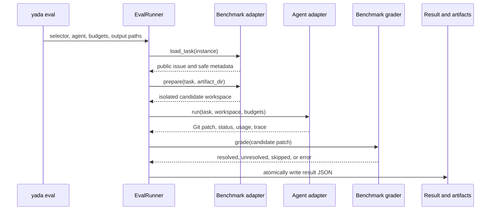

# Evaluation lifecycle

This document explains what Yada does after either public evaluation command:

```bash
uv run yada eval --case PATH [OPTIONS]
uv run --with 'swebench==4.1.0' yada eval --swebench INSTANCE_ID [OPTIONS]
```

For option syntax, see the [CLI reference](cli-reference.md). For the internal
adapter contracts, see the [architecture](dev/architecture.md). This document
focuses on observable execution: inputs, network access, workspaces, grading,
caches, and output files.

## Common pipeline

Both selectors run one task through the same benchmark-neutral pipeline:



Before this pipeline starts, the CLI:

1. requires exactly one of `--case` or `--swebench`;
2. resolves the result and artifact paths;
3. creates a run ID containing UTC time and a random suffix;
4. configures the native Yada or external command agent; and
5. requires `DEEPSEEK_API_KEY` when the native Yada agent is selected.

The default result name uses system-local time at minute precision. A collision
adds `(1)`, `(2)`, and so on. The result and artifact directory always receive
the same suffix.

Once `EvalRunner` starts, it creates the artifact directory and attempts every
phase in order: load, prepare, agent, then grade. Ordinary adapter exceptions are
recorded in the result JSON instead of losing the whole run. Argument errors and
a missing API key happen before the runner starts and therefore do not create a
result.

The grader owns the final verdict. The agent's `finish` call and summary do not
make an evaluation `resolved`.

## Why Yada keeps both selectors

`--case` and `--swebench` are not two spellings for the same operation. They
preserve two different contracts:

| | `--case PATH` | `--swebench INSTANCE_ID` |
| --- | --- | --- |
| Primary use | Fast development, regression cases, private tasks, and custom benchmarks | Comparable SWE-bench Verified runs |
| Task and grader authority | The checked-in or local `case.json` | The pinned official Harness and dataset |
| Native Yada commands | Host/uv environment declared by the case | Public SWE-bench instance image in Docker |
| Final grading | Manifest command; may be partial or project-specific | A separate official Harness container |
| Docker required by Yada | No | Yes, checked before any model request |
| Result meaning | Local development result | Official-compatible SWE-bench verdict |

Removing `--case` would make every quick tool or prompt regression depend on
Docker, a network dataset, and the full official grader. Treating a local case
as an official run would be worse: its dependencies or test selection can
differ and produce a false pass. Keeping the boundary explicit lets Yada remain
small and usable without Docker while reserving comparable claims for
`--swebench`.

Without Docker, use direct `yada ...` for normal repository work or
`yada eval --case PATH` for a reproducible local evaluation. A case manifest
may choose to invoke Docker itself, but Docker is not a Yada requirement for
this path.

## Local case: `--case PATH`

Example:

```bash
uv run yada eval \
  --case benchmarks/swebench_verified/pytest-10051 \
  --yes \
  --trace-level debug
```

`PATH` may be a case directory or a manifest file. A directory resolves to
`PATH/case.json`.

### 1. Load the case recipe

The local adapter reads `case.json`. The manifest must provide exactly one
public task source:

- `problem_statement`: inline issue text;
- `task_file`: a UTF-8 file relative to the manifest; or
- `instance_file`: a local public-instance record.

When an `instance_file` is used, only public metadata such as repository, base
commit, version, and dataset provenance enters the task. Gold patches and test
patches are not included in the task passed to the agent.

The checked-in `pytest-10051` case uses its bundled `instance.json`. That file is
part of the local development recipe; it is not used by official `--swebench`
runs.

### 2. Prepare the source and environment

The manifest's `workspace` is either a local path or a pinned Git recipe.

For a Git recipe, Yada stores a reusable source checkout under:

```text
.yada/cache/evals/<cache_key>/repo
```

On the first run it initializes that cache, fetches only the declared base
commit, and checks it out detached. On later runs it verifies the remote URL,
exact `HEAD`, and clean worktree before reuse. The cache is a source template;
the agent does not edit it directly.

If the case declares a uv environment, Yada runs `uv sync --locked` in the
case's environment project. This can create or update a persistent `.venv`
inside the case directory. For the checked-in pytest case, that is why
`benchmarks/swebench_verified/pytest-10051/.venv` exists after the first run.
The sync command is invoked on every evaluation so the lock remains the source
of truth, while uv reuses the existing environment and package cache when they
already match. For `pytest-10051`, the manifest requests Python 3.9.10 and then
installs the cached source into that environment with the declared legacy
editable setup. The persistent `.venv` belongs to the case recipe, not to the
per-run candidate workspace; seeing it change is therefore expected.

With the default `workspace_mode=copy`, Yada then copies the clean source into a
new candidate workspace inside this run's artifact directory. Git metadata is
preserved, while `.yada`, `__pycache__`, and `.pytest_cache` are excluded. The
manifest can explicitly request `in_place`, but reproducible checked-in cases
should normally use `copy`.

For `pytest-10051`, the effective layout is:

```text
case.json and grader.py
        │
        ├── persistent source cache at the exact pytest base commit
        ├── persistent locked Python 3.9 environment in the case directory
        └── fresh eval-results/<run>.artifacts/workspace for the agent
```

### 3. Run the agent

The native Yada adapter receives only the public problem statement and candidate
workspace. It supplies the case environment through `PATH`, `VIRTUAL_ENV`, and
configured `PYTHONPATH` entries.

This path does not attach Yada's Docker command backend. `run_command` executes
on the host in the case's prepared uv environment, with the candidate workspace
as its repository root. `--yes` skips interactive approval for those
model-requested commands; it does not skip environment preparation or grading.

During the run:

- all model-facing file operations stay inside the candidate workspace;
- the selected editing strategy and model-facing tool schemas stay fixed;
- edits are SHA-bound and applied through checked patch transactions;
- `run_command` uses the configured approval policy;
- `finish` requires a successful test or build after the latest edit; and
- events are appended to `yada-trace.jsonl`.

After the agent stops, Yada collects all tracked and untracked Git changes into
one patch relative to `HEAD`.

For the native adapter, `agent_run.details` also records the selected
`editing_strategy` and trace-derived `editing_metrics`, including first-edit
success, eventual mutation success, edit retries, per-tool attempts, structured
error counts, rejected editing calls, and post-edit verification status. Use
the same task, model, parameters, and budgets when comparing `patch-only` with
`replace-first`.

### 4. Run the case grader

Yada writes the collected patch to `agent.patch`, substitutes manifest
placeholders such as `{workspace}`, `{patch}`, `{run_dir}`, and `{run_id}`, and
runs the declared grader from the case directory.

For the checked-in pytest case, the grader:

1. verifies that the candidate remains at the expected base commit;
2. copies the candidate to a temporary grading workspace;
3. applies the case's test patch only inside that grading copy; and
4. runs one FAIL_TO_PASS plus fifteen PASS_TO_PASS tests.

The candidate workspace given to the agent never contains the test patch.

Local grader exit codes map to verdicts as follows:

| Grader exit | Evaluation status |
| --- | --- |
| `0` | `resolved` |
| `1` | `unresolved` |
| anything else or timeout | `error` |
| no grader in manifest | `skipped` |

This verdict is a local development result, not an official SWE-bench score.

## Official SWE-bench: `--swebench INSTANCE_ID`

Example:

```bash
uv run --with 'swebench==4.1.0' yada eval \
  --swebench pytest-dev__pytest-10051 \
  --yes \
  --trace-level debug
```

Docker must already be running. Yada checks both the Docker CLI and daemon
before loading the dataset or making a model request, so a missing Docker setup
does not spend model tokens. The `--with` option asks uv to make the pinned
official Harness available to this process. It does not add `swebench` or the
Docker Python client to Yada's project dependencies and does not require a
SWE-bench Git clone. The first run downloads the package into uv's cache; later
runs reuse it.

`uv --with` dependency resolution happens before the `yada` process starts.
Consequently, an `Installed N packages` message can appear before Yada checks
Docker, and uv may spend time populating its cache even when the later Docker
preflight fails. That work is package setup, not a model request, and still uses
no model tokens.

Use a maintained Docker Desktop or Docker Engine release. SWE-bench 4.1.0 does
not publish an exact minimum Docker version, so Yada requires functional client,
daemon, image, platform, mount, and container support rather than checking a
version string. Legacy Docker Toolbox and obsolete standalone clients are not
supported. Follow [Docker requirements](configuration.md#docker-requirements)
to install and validate Docker before running this command.

### 1. Check Docker and load one official public task

The adapter invokes the official Harness environment to read
`pytest-dev__pytest-10051` from:

```text
dataset: princeton-nlp/SWE-bench_Verified
split:   test
```

The Harness may download or reuse the Hugging Face dataset cache. Before the
record crosses into Yada, it is reduced to a fixed public-field allowlist:

- instance ID;
- repository and base commit;
- public problem statement;
- version, difficulty, dates, and dataset provenance when available.

Gold patches, test patches, FAIL_TO_PASS IDs, and PASS_TO_PASS IDs are not
returned to the agent process.

### 2. Prepare the public instance image and candidate workspace

Through the pinned Harness environment, Yada derives the instance's official
public image name. It pulls that image when available or asks the Harness to
build it locally. This instance image contains the repository and its public
setup: installed dependencies, generated source files, and the configured
`testbed` environment. It does not contain the evaluation test patch or the
Harness evaluation script.

Image preparation is streamed rather than buffered until completion. Before it
starts, Yada prints the two artifact log paths. Harness stdout and stderr then
appear in the terminal with `[swebench image stdout]` and
`[swebench image stderr]` prefixes while the same raw streams are flushed to:

```text
swebench-agent-image.stdout.log
swebench-agent-image.stderr.log
```

If the Harness or Docker produces no line for 30 seconds, Yada prints a
`still running` heartbeat with elapsed time. The log files are created at the
start and retain partial output after a preparation failure or timeout. This
stage is before the Agent phase, so `yada-trace.jsonl` may not exist yet and no
model tokens have been used. On Apple Silicon the no-namespace policy commonly
means a local image build rather than a registry pull; package installation
inside that build can be the longest quiet-looking stage.

Yada exports the image's `/testbed` to `<artifact_dir>/workspace`, preserving
`.git`, and verifies that the dataset base commit is an ancestor of its `HEAD`.
`HEAD` can be a Harness setup commit after the base commit; requiring equality
would discard legitimate generated setup files. The mutable exported workspace
is the source of the eventual model patch. It does not contain the future human
solution. Yada prints messages before this export and after the workspace is
ready, so a large `docker cp` is distinguishable from image preparation.

### 3. Run Yada and collect the prediction

For the native Yada agent, file tools read and edit the exported host workspace.
Each `run_command` starts or reuses an ephemeral Agent container from the same
public instance image, bind-mounts that workspace at `/testbed`, activates the
image's `testbed` environment, and runs there. The container is removed when
the agent stops. This prevents host Python state from creating a false pass
while keeping file application simple and inspectable.

The Agent container has no test patch or evaluation script. It is distinct from
the grading container created later. An external `--agent command` process is
still launched by its own host command; that adapter is responsible for its own
execution isolation.

When the agent stops, Yada collects the complete Git patch and writes
`predictions.jsonl` with exactly:

- `instance_id`;
- `model_name_or_path`; and
- `model_patch`.

### 4. Grade in a separate official Harness container

Yada invokes `swebench.harness.run_evaluation` with the built-in policy:

| Harness setting | Value |
| --- | --- |
| Dataset and split | `princeton-nlp/SWE-bench_Verified`, `test` |
| Instances | the single requested ID |
| Workers | `1` |
| Test timeout | `1800` seconds |
| Image cache level | `env` |
| Clean existing cache | `false` |
| Image namespace | `swebench`, or none on Apple Silicon |

The Harness starts a new container independently of the Agent container,
applies only the collected model patch, injects its evaluation test patch and
script, and produces the official run report. Hidden grading inputs therefore
never enter the Agent container or model context. On Apple Silicon, Yada
automatically disables the prebuilt-image namespace so the Harness builds
compatible images locally. That path is experimental and can consume
substantial time and disk space.

Official grader stdout and stderr are also streamed to the terminal and flushed
live to `swebench.stdout.log` and `swebench.stderr.log`. The same 30-second
no-output heartbeat applies, so a long test does not look like a hung Yada
process and partial Harness diagnostics survive a timeout.

Yada maps membership in the official report's `resolved_ids` or
`unresolved_ids` to its final verdict. A missing report, incomplete instance, or
Harness failure becomes `error` rather than being guessed as a model failure.

Across one official run there are three distinct container lifetimes:

| Container | Purpose | Lifetime |
| --- | --- | --- |
| Export container | A stopped container used only to copy `/testbed` into the artifact workspace | Created and removed during preparation |
| Agent container | Executes native Yada `run_command` calls against the bind-mounted mutable workspace | Created lazily, reused during the Agent phase, then removed |
| Grader container | Receives the model patch plus official evaluation inputs and produces the verdict | Owned and removed according to the Harness policy |

Docker or the Harness may also create temporary builder containers while making
an uncached image. Those are image-build implementation details, not an
additional place where the agent edits code.

## Files written by a run

With default paths, one evaluation produces a result and a sibling artifact
directory:

```text
eval-results/
├── <task>__<local-time>.json
└── <task>__<local-time>.artifacts/
    ├── workspace/
    └── yada-trace.jsonl
```

Additional files depend on the selector:

| File | `--case` | `--swebench` |
| --- | --- | --- |
| `workspace/` | Fresh copy unless manifest requests `in_place` | `/testbed` exported from the public instance image |
| `yada-trace.jsonl` | Native Yada execution trace | Created when the Agent phase begins; it does not cover earlier image preparation |
| `agent.patch` | Patch supplied to the local grader, when configured | Patch is stored inside `predictions.jsonl` |
| `grader.stdout.log`, `grader.stderr.log` | Local grader output | — |
| `predictions.jsonl` | — | Official Harness input |
| `swebench-agent-image.stdout.log`, `swebench-agent-image.stderr.log` | — | Created immediately and updated live during public image preparation; partial logs survive failure |
| `swebench.stdout.log`, `swebench.stderr.log` | — | Created and updated live during official grading; partial logs survive timeout |
| `<model>.<run_id>.json` | — | Official Harness summary report |
| Harness `logs/` and image build data | — | Created by the official Harness |

The top-level result JSON records:

- run, benchmark, instance, and agent identity;
- start time and duration;
- a hash and length of the public problem statement;
- safe task provenance;
- agent status, patch, steps, tokens, summary, and trace path;
- grader verdict and diagnostics; and
- any ordinary pipeline error.

It is written atomically through a temporary file. CLI exit codes are `0` for
`resolved`, `1` for `unresolved`, and `2` for errors, skipped grading, or other
non-verdict outcomes.

## Network and persistent state

The two selectors have different side effects:

| Resource | `--case` | `--swebench` |
| --- | --- | --- |
| DeepSeek API | Native Yada agent | Native Yada agent |
| Git network | First pinned-source fetch, then case cache | Only when the Harness must build an uncached image |
| Python packages | First case `uv sync`, then case `.venv` | First `uv --with`; image builds may also install task dependencies |
| Dataset network | None when the case is fully local | Hugging Face dataset, then its cache |
| Docker | Only if the case grader declares it | Required before the model runs; separate Agent and grader containers |
| Persistent large data | Source cache and case `.venv`, when declared | uv/Hugging Face caches and Docker images |
| Mutable candidate | Per-run artifact workspace | Per-run artifact workspace |

`--yes` changes the native agent's repository-command approval policy. It does
not disable task preparation, dependency resolution, Git fetching, or grading;
those are benchmark-adapter operations outside the model-facing tool loop.

Repository tests and benchmark graders execute code. Direct runs and `--case`
commands use the host unless their case provides isolation. Native
`--swebench` repository commands run in Docker, but Docker daemon access and
host-mounted files remain security-sensitive. Review debug traces before
publishing them.
